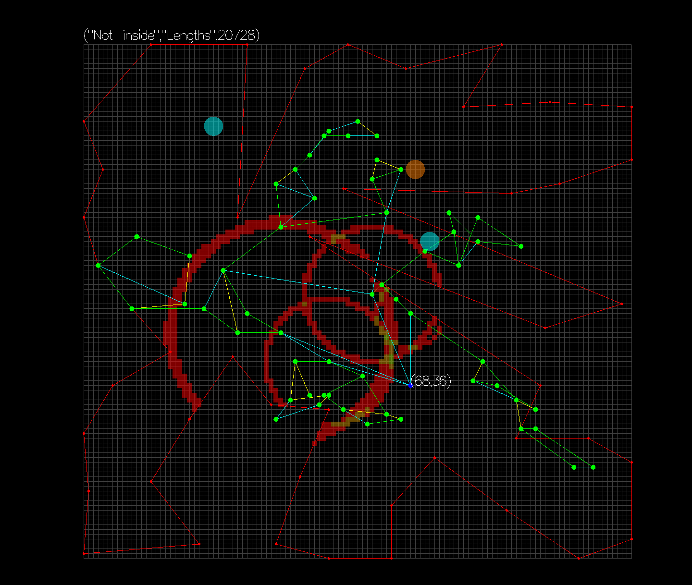

ICFP Contest 2021 Team Powder
=============================

Repository structure
--------------------
The repository contains a number of Haskell packages built with Stack. Four executables are built:
 - `rate` validates and rates a solution
 - `editor` is a viewer and editor for solutions, featuring a number of semi-automated tools
 - `anneal` is a solver using simulated annealing
 - `propagate` is a propagator circuit solver
See the module header in each respective `Main.hs` for how to use them.
There is also a short shell script `http.sh` for curling at the HTTP API.

Solutions
---------
In one way or another we have submitted solutions for most of the problems. Most of the exactly solved problems were
brute forced by our propagator circuit based solver. Most of the approximately solved problemes were found via simulated
annealing. A lot of problems were also solved semi-manually using a GUI editor with a bunch of utility tools. Select few
problems were solved by combining all of the above!.

Editor
------

*(A vertex being dragged in the editor)*

An extremely simple Gloss GUI for viewing/editing problems/solutions, augmented with a lot of tools that help in manual
solving.

Its featureset includes:
- Selecting multiple vertices and dragging them around
- Displaying whether any edges are stretched or compressed
- Validating and scoring a pose
- When dragging a single vertex, displaying all constraints (rasterized!) that it must satisfy from incident edges, and
  highlighting intersections of those constraints
- Auto-fitting points to their constraints
- Flipping and rotating (in 90deg increments) chunks of the pose
- Displaying which hole points are visible from which (rasterized!)
- Displaying which edges of the hole match edges of the pose
- Finding chains of edges in the pose that match exactly to some subsequence of the boundary
- A failed implementation of ragdoll physics
- A successful implementation of spring physics
- Finding corners of the boundary where only a certain vertex with its pair of edges would fit
- Repeal points away from center of mass (untangle them)

The editor is implemented mostly in `editor/app/Main.hs`, though a lot of solution-optimizing utilities are implemented
in `common/src/ICFPC/Geometry.hs`.

Simulated Annealing
-------------------
One of our solvers applies simulated annealing to the pose, using the score as the primary metric. The score is further
augmented with penalties for invalid solutions. The penalties are picked so that their gradients point towards solutions
that are more valid:
 - When an edge intersects the border, how far past the border does it go
 - When an edge has incorrect length, by how much does it need to be changed to be valid

Having these as "soft" penalties on descent as opposed to "hard" constraints allows the solution to jump from one region
of correctness to another, as part of annealing. Nevertheless the penalties come with large coefficients so that as
the temperature is lowered we eventually most likely enter a regime with only valid solutions.

Among random solution modifications we also consider some more discrete steps such as moving a vertex/edge all the way
to a matching vertex/edge on the boundary.

If the temperature drops very low we consider the pose to be stuck at a local minimum, and we raise the temperature to
hopefully try something else.

Annealing is implemented in `common/src/ICFPC/Annealing.hs`, `anneal/app/Main.hs`.

Propagators
-----------
Our other solver is an exact constraint satisfiability solver, using propagator circuits. We represent every vertex's
set of possible positions, and every edge's set of possible "directions" with a bitmap.

Due to a fairly large "depth" of the search tree (and hence immense width), when doing a brute force search we want to
cut off as many useless branches as possible. So at every step we do constraint solving on the remaining vertices, to
find out as much as possible about them using "local" constraints so as to defer making any guesses.
 - If we know the set of possible "directions" of an edge, and the set of possible positions of one of its vertices, we
   can use that to improve (reduce) the set of possible positions of the other vertex, by taking what looks essentially
   like a minkowski sum of the two sets (adjusted appropriately so that the edge is always within the polygon).
 - If we know the directions of two edges that form a triangle, we can improve the constraint on the third edge.

Once such constraint propagation settles, we are forced to make a guess, i.e. to make a branching point in our search
tree. Again due to the depth/breadth issues, we want to be careful about doing this. For medium-sized problems taking
branches in an incorrect order can easily produce a search tree of an unrealistic breadth, so we want to prioritize not
having too many guesses to choose from. For large-sized problems iterating even the set of valid solutions is infeasible
so we want to prioritize making certain guesses that heuristically seem fruitful: placing vertices in corners of the
hole.

For every vertex/edge we have to keep track of its set of allowed positions, and these sets can be relatively large, so
we Run Length Encode them. This encoding nevertheless admits very efficient union/intersection and translation
operations, and that's all we need to propagate constraints.

The constraint propagation solver is implemeted in `propagators/src/ICFPC/Propagators.hs` and `propagators/app/Main.hs`,
with RLE-aware geometry utilities in `common/src/ICFPC/Polygon.hs`.
